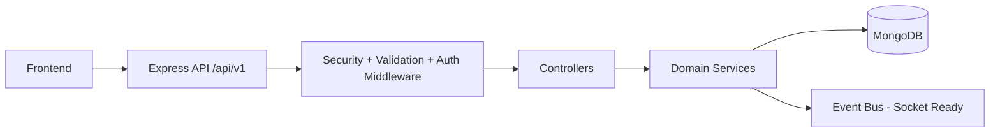
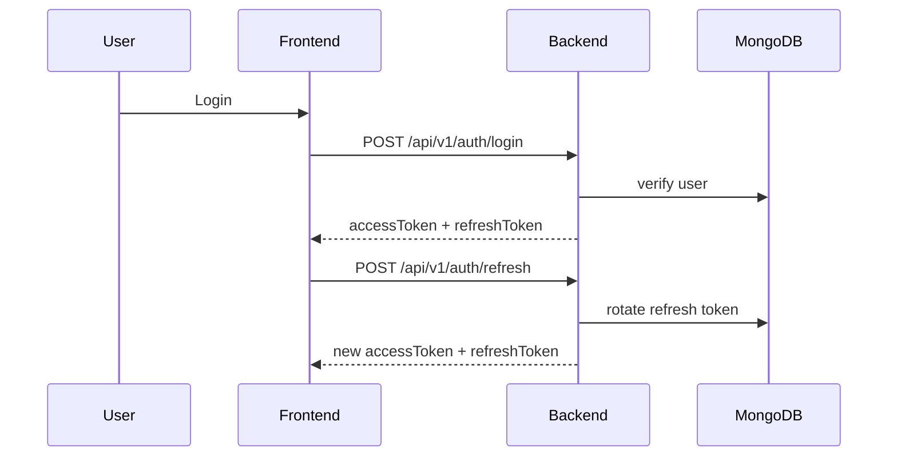

# IronPulse AI Backend

Production-ready backend for the IronPulse AI fitness platform with JWT + refresh token auth, strict CORS, analytics pipelines, progression engine, streak and XP systems, Swagger docs, pagination/filtering, and deployment/testing foundations.

## Architecture Overview

- **Runtime**: Node.js, Express, MongoDB, Mongoose
- **Security**: Helmet, rate limit, mongo sanitize, hashed passwords, JWT verification, refresh token rotation
- **Observability**: Winston request/error logging, health endpoint, standardized errors
- **Contract-first API**: every response uses frontend-friendly wrapper
- **Scalable design**: modular services/controllers/routes with reusable utilities

## High-Level API Flow



## Authentication Flow



## Standard Response Contract

Success:

```json
{
  "success": true,
  "message": "Request successful",
  "data": {},
  "meta": {}
}
```

Error:

```json
{
  "success": false,
  "message": "Validation failed",
  "errors": []
}
```

## Folder Structure

- `src/config`: DB, env, CORS, Swagger config
- `src/controllers`: API handlers only
- `src/services`: domain/business logic
- `src/models`: Mongoose schemas + indexes
- `src/middlewares`: auth, validation, logging, errors
- `src/utils`: response wrapper, jwt/token helpers, pagination, logger, events
- `src/routes`: versioned REST endpoints
- `src/jobs`: cron-ready jobs
- `src/analytics`, `src/progression`, `src/notifications`: domain modules

## Setup Guide

1. Install dependencies: `npm install`
2. Copy env file: `.env.example` -> `.env`
3. Provide values:
   - `PORT`
   - `MONGO_URI`
   - `JWT_SECRET`
   - `JWT_REFRESH_SECRET`
   - `NODE_ENV`
   - `FRONTEND_DEV_URL`
   - `FRONTEND_URL`
4. Run development server: `npm run dev`

## API Docs

- Swagger UI: `GET /api/docs`
- Health check: `GET /health`

## Main Endpoint Groups

- Auth: register, login, refresh, logout, profile
- Workouts: today, week, day, start, complete set, finish, history
- Analytics: daily, weekly, monthly, logs
- Progression: current progression + recommendations
- Bodyweight: add + paginated history
- Notifications: motivation + paginated history
- Dashboard: frontend-ready home metrics

## Pagination & Filtering

Supported query params on history/log endpoints:

- `page`
- `limit`
- `sort`
- `from`
- `to`

## Deployment Guide

- Local container:
  - `docker compose up --build`
- Production image:
  - `docker build -t ironpulse-backend .`
  - `docker run --env-file .env -p 5000:5000 ironpulse-backend`

## Testing

- Run test suite: `npm test`
- Includes starter Supertest suites for:
  - auth contract
  - workout auth guard
  - analytics auth guard

## Scaling Strategy

- Keep controllers thin, move heavy logic to services
- Extend event bus (`src/utils/events.js`) to plug in websocket broadcasting
- Add Redis cache behind service layer without route/controller changes
- Promote analytics log pipelines to async jobs for high-volume usage
